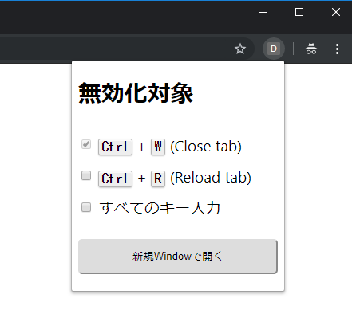

# 特定のキー入力（キーボードショートカット）を無効化してページに入力できるようにするChrome拡張
Chromeが一部キーボードショートカットを無効化する。

## ユースケース例
- Webページで提供されているshellで `Ctrl` + `W` を使いたい
    - Webページで提供されているshellの例
        - [AWS Systems Manager Session Manager](https://aws.amazon.com/jp/blogs/news/new-session-manager/)
    - `Ctrl` + `W`
        - Chrome: タブを閉じる（通常はこちらが優先される）
        - shell: 単語単位で削除

## 仕組み
1. 現在のタブをChrome拡張のポップアップで新規に開く
    - Chromeのキーボードショートカットへの割り込みを可能にするため
1. 無効化したいキーボードショートカット押下時のイベントをキャンセルする

## 使い方
1. 拡張をインストール
1. Webページにアクセス
1. 拡張アイコンをクリック 
    
1. ボタン `新規Windowで開く` をクリック
    - 今まで開いていたページ（タブ）がポップアップWindowになり `Ctrl` + `W` で閉じなくなります

## 無効化対象キーボードショートカット
- `Ctrl` + `W` （タブを閉じる）

## 注意点
- 実行した後にページ遷移するとキーボードショートカットの無効化の効果が無くなる

